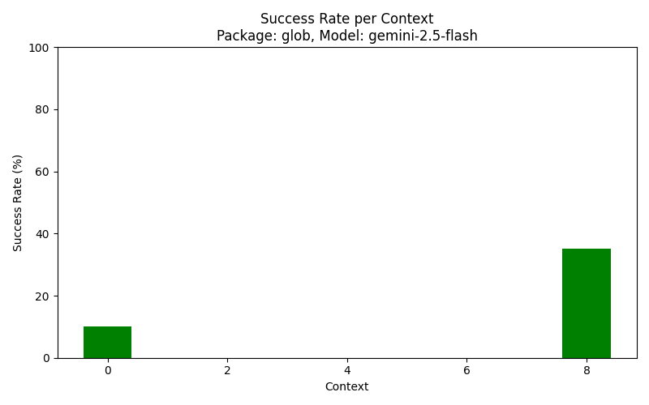
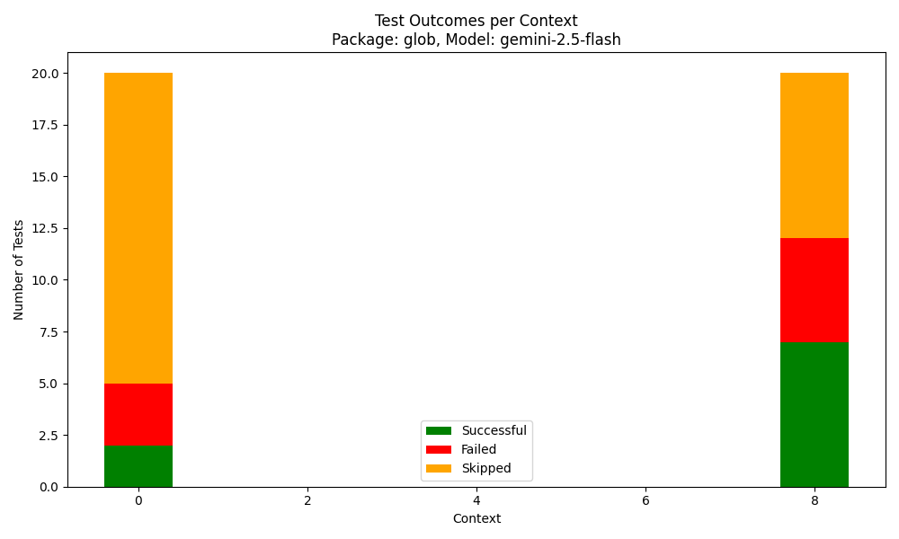

# [Google Summer of Code][gsoc] 2025 Final Report ☀️

- **Project Title:** TestGen – LLM-based Test Generation Tool

- **Organization:** [Dart Programming Language][dart]

- **Contributor:** [Amr Ahmed][me]

- **Mentors:** [Liam Appelbe][liam], [Brian Quinlan][brian]

- **Project Size:** Medium, 175 hours

- **Project Repository:** [TestGen Repo][projectrepo]

## Project Description

TestGen is an experimental project aimed at building an automated unit test generation tool for Dart. Its primary goal is to improve test coverage by generating test cases that specifically target uncovered lines in the codebase. By leveraging AI to produce meaningful and maintainable tests, TestGen reduces the manual effort required to write tests, helping developers achieve higher coverage and improve code quality.

## Challenges

Using LLMs for automated test generation introduces several unique challenges, particularly in determining the most effective way to prompt the LLM when testing a function.
- **The primary challenge** lies in determining how much contextual information to provide to the model: too much context *(such as entire files)* can overwhelm the LLM, leading to irrelevant tests, hallucinations, and unfocused outputs, while too little context *(such as function body only)* may result in missing crucial dependencies, incomplete edge case coverage, and tests that fail.
- **Additionally**, Generated test cases may be incorrect, redundant, or fail to cover critical edge cases, so workarounds need to be done to fix the failed tests.

## Solution Approach

- Addressing the first challenge: We leverage the Dart analyzer package to parse the entire codebase and construct a dependency graph across declarations. This allows us to selectively provide only the relevant context when prompting the LLM for a specific function, ensuring the prompt is both focused and effective without overwhelming the model.

- Addressing the second challenge: We implement an iterative feedback loop with the LLM. After test cases are generated, they are validated through a series of checks (e.g., free of compilation errors, all tests passing). If any check fails, the corresponding errors are fed back into the LLM within the same session, enabling it to refine and correct the test cases until they meet the desired quality.

## Project Milestones

The project was structured around several key milestones that guided its development, including the following:

1- **Command-Line Interface (CLI):** Developed a CLI tool to let developers easily interact with the package and configure test generation options.  

2- **Coverage Integration:** Used Dart’s [`package:coverage`][coverage] to automatically identify and target untested code segments.  

3- **Static Analysis & Dependency Graph:** Leveraged Dart’s [`package:analyzer`][analyzer] to perform static analysis, extract declarations, and construct a dependency graph used for context-aware prompting.  

4- **Context-Aware Prompting:** Designed a prompt generation mechanism that retrieves a function’s context up to a configurable depth to enhance test generation accuracy.  

5- **LLM Integration:** Connected with Gemini LLMs via [`package:google_generative_ai`][google_generative_ai], enabling the use of models such as `gemini-2.5-pro`, `gemini-2.5-flash`, and `gemini-2.5-flash-lite`.  

6- **Validation & Feedback Loop:** Implemented an iterative validation process that executes generated tests, performs static checks, and feeds errors back into the LLM for refinement.  

## Contributions

During the GSoC period, I made the following pull requests to [TestGen Repository][projectrepo]:

| # | Title | Status |
|------|-------|--------|
| 1  | [Implement argument parsing and coverage options for test coverage][3] | ✅ Merged |
| 2 | [Integrate Dart Coverage Package for Test Coverage Collection][4] | ✅ Merged | 
| 3 | [Integrate Analyzer Package To Extract Code Declarations][7] | ✅ Merged | 
| 4 | [Build Dependency Graph Between Dart Declarations][9] | ✅ Merged |  
| 5 | [Extract Target Declarations for Testing][11] | ✅ Merged |
| 6 | [LLM Prompt Context Generation and Formatting][14] | ✅ Merged |
| 7 | [Implement LLM-based Test Generation with Iterative Feedback Loop][16] | ✅ Merged |
| 8 | [Add Benchmarking Framework for Testgen Performance Evaluation][21] | ✅ Merged |
| 9 | [Use HitMap.parseJson during formatting][22] | ✅ Merged | 
| 10 | [Refactoring code & Enhanced validation checks][24] | ✅ Merged | 
| 11 | [Add README, package metadata, and sample examples][25] | ✅ Merged | 

## Results

The TestGen package has been successfully tested on several Dart packages, demonstrating significant improvements in test coverage across various scenarios, effectively increasing coverage for projects with existing tests as well as generating tests for projects that previously had none.

### Benchmarking and Performance Analysis

We implemented a comprehensive benchmarking framework to evaluate TestGen's performance across different parameters:

- **Model Variations**: Tested with different Gemini models (`gemini-2.5-pro`, `gemini-2.5-flash`, `gemini-2.5-flash-lite`)

- **Package Diversity**: Evaluated on various Dart packages with different complexity levels (`glob`, `fftea`, ...)

- **Context Depth**: Analyzed the impact of varying context depth during prompting

These are the results from a simple run of the benchmarking tool on the `glob` package, testing 20 declarations using the `gemini-2.5-flash` model with **context depth 0 and 8**.

<table>
  <tr>
    <td></td>
    <td></td>
  </tr>
</table>

The results show a nearly **25% increase in the success rate** of test case generation, validating our approach of using dependency-aware context to improve both the accuracy and relevance of the generated tests.

## Future Work

The TestGen project continues to evolve with several areas identifd for further investigation and improvement. Currently, there are [5 open issues][issues] in the TestGen repository that outline potential enhancements and research directions:

| # | Title | Status | Type |
|---|--------|--------|------|
| 1 | [Add support for alternative LLM providers (ChatGPT, Claude)][29] | 🔄 Open | Enhancement |
| 2 | [Experiment with alternative prompt formats and context presentation][28] | 🔄 Open | Enhancement |
| 3 | [Investigate Flutter project compatibility and required adaptations][27] | 🔄 Open | Investigation |
| 4 | [Enhance benchmarking infrastructure and analytics][26] | 🔄 Open | Enhancement |
| 5 | [Enable LLM to request additional context][18] | 🔄 Open | Enhancement |

## Lost in the AST 🌲

One of the most challenging and rewarding parts of the project was integrating the [`package:analyzer`][analyzer] to perform **static code analysis**. This involved parsing the source code, constructing the dependency graph, and working directly with the **Abstract Syntax Tree (AST)** to connect dependencies. This required a deep dive into the internals of the Dart language, often involving extensive study of the analyzer’s documentation and even parts of Dart's grammar specification. Although challenging, this experience became the most interesting and educational aspect of the project.

## Acknowledgements 🙏💙

Alhamdulillah, I am grateful to have been accepted into this project.

I would like to sincerely thank the entire Dart Team and my mentors for making me feel part of the community — everyone was incredibly kind, supportive, and helpful throughout the journey.

A special thanks goes to my mentor, [Liam][liam], for his continuous guidance and encouragement.

### Until Next Commit… 🔗✨

[gsoc]: https://summerofcode.withgoogle.com/
[dart]: https://dart.dev/
[me]: https://github.com/AmrAhmed119
[liam]: https://github.com/liamappelbe
[brian]: https://github.com/brianquinlan
[projectrepo]: https://github.com/AmrAhmed119/dart-testgen
[coverage]: https://pub.dev/packages/coverage
[analyzer]: https://pub.dev/packages/analyzer
[google_generative_ai]: https://pub.dev/packages/google_generative_ai/versions/0.4.6
[issues]: https://github.com/AmrAhmed119/dart-testgen/issues
[3]: https://github.com/AmrAhmed119/dart-testgen/pull/3
[4]: https://github.com/AmrAhmed119/dart-testgen/pull/4
[7]: https://github.com/AmrAhmed119/dart-testgen/pull/7
[9]: https://github.com/AmrAhmed119/dart-testgen/pull/9
[11]: https://github.com/AmrAhmed119/dart-testgen/pull/11
[14]: https://github.com/AmrAhmed119/dart-testgen/pull/14
[16]: https://github.com/AmrAhmed119/dart-testgen/pull/16
[21]: https://github.com/AmrAhmed119/dart-testgen/pull/21
[22]: https://github.com/AmrAhmed119/dart-testgen/pull/22
[24]: https://github.com/AmrAhmed119/dart-testgen/pull/24
[25]: https://github.com/AmrAhmed119/dart-testgen/pull/25
[18]: https://github.com/AmrAhmed119/dart-testgen/issues/18
[26]: https://github.com/AmrAhmed119/dart-testgen/issues/26
[27]: https://github.com/AmrAhmed119/dart-testgen/issues/27
[28]: https://github.com/AmrAhmed119/dart-testgen/issues/28
[29]: https://github.com/AmrAhmed119/dart-testgen/issues/29